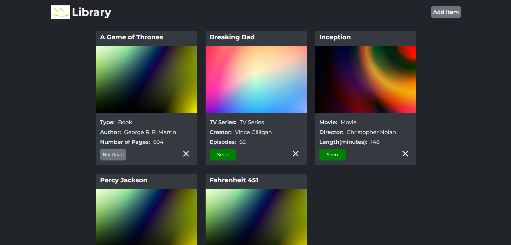
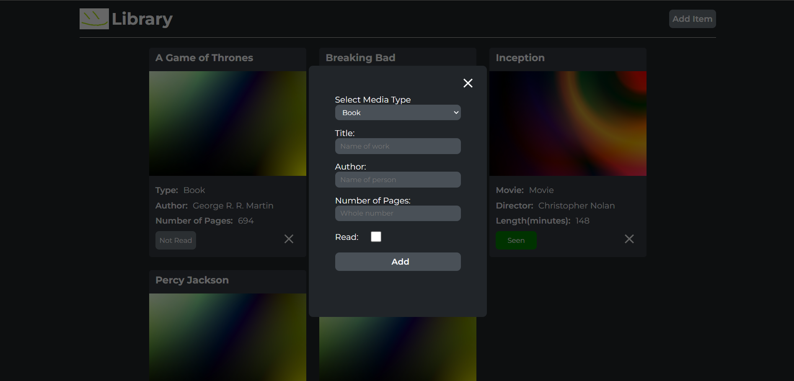

# library
### Description
This project was made in order to help practice my skills using objects and prototypes in JavaScript. There is no long-term storage option using a database as of now, but I may revisit this at some point in the future.

To add a new library item, click the "Add Item" button and fill out the form that pops up. Library items can be deleted and marked as read or not read. This is more of a read/seen list.

Live Page: https://hpagon.github.io/library/

### Credits
- [The Odin Project](https://www.theodinproject.com/)
- [Card Images by Codioful (Formerly Gradienta)](https://unsplash.com/@codioful?utm_content=creditCopyText&utm_medium=referral&utm_source=unsplash)
